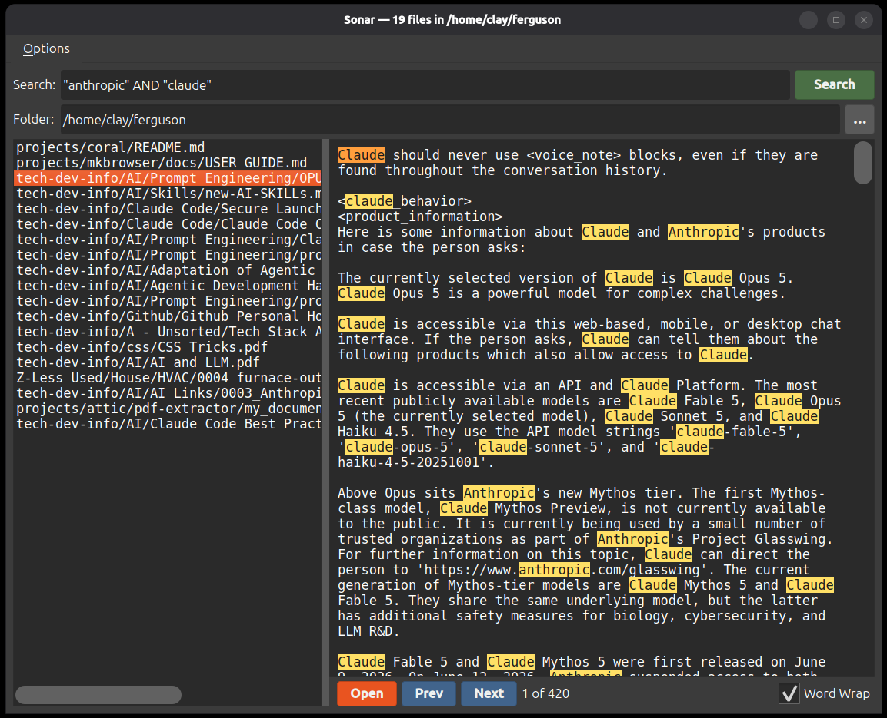
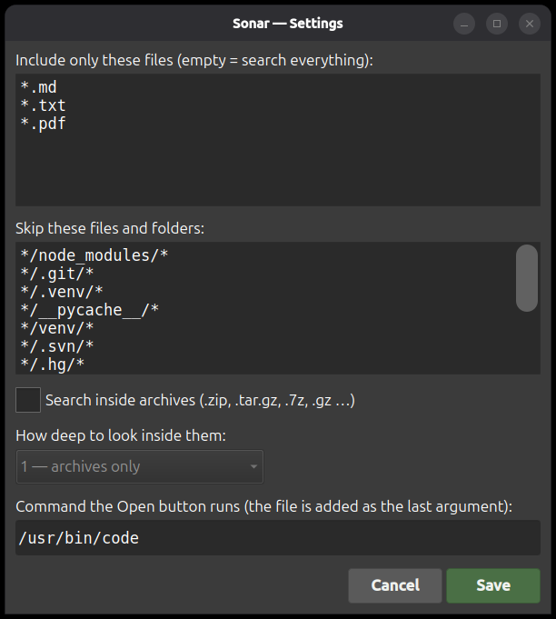

# Sonar


A desktop search utility: type a query, get every file under a folder whose
*contents* match, and read them without leaving the window.

[ugrep](https://github.com/Genivia/ugrep) does the searching, so queries are
Google-style Boolean expressions and a whole source tree is scanned in
seconds. Sonar is the window around it — results stream in as they are found,
clicking one shows the file with every match highlighted, and **Open** hands it
to your editor.

## Sonar App Window


## Settings Dialog


**Highlights**

- Boolean queries — `cat dog`, `cat OR dog`, `"exact phrase"`, `cat -dog` —
  matched anywhere in a file, case-insensitively
- Every match highlighted in the preview, with Prev/Next and a counter
- PDFs rendered in the window and searched in place
- Optional search *inside* archives (`.zip`, `.tar.gz`, `.7z`, `.gz` …), up to
  three levels of nesting
- Include/exclude glob patterns and a configurable Open command

## Documentation

📖 **[User Guide](docs/USER_GUIDE.md)** — the full walkthrough: every control
in the window, the query language, PDFs, archive searching, the settings
dialog, keyboard shortcuts and troubleshooting. Start here.

⚙️ **[Configuration reference](docs/CONFIG.md)** — the YAML file behind the
settings dialog, key by key.

🛠 **[AGENTS.md](AGENTS.md)** — architecture and implementation notes, for
anyone working on the code.

## Requirements

```bash
sudo apt install ugrep
```

`ugrep` is required — Sonar says so and exits if it is missing. `uv` is
required to launch (see [uv's install page](https://docs.astral.sh/uv/)); it
pulls in PyQt6 and PyYAML on first run.

Optional: `poppler-utils`, for `pdftotext`. With it installed, ugrep searches
the text inside PDFs, so they turn up in results.

## Running

```bash
./start.sh                      # search the current directory
./start.sh /path/to/folder      # start on a particular folder
```

The folder is the only argument, and it just prefills the **Folder** row —
nothing is searched until you type a query and press Enter.

`start.sh` runs the app through [uv](https://docs.astral.sh/uv/), which creates
and refreshes the virtualenv from `pyproject.toml` on every run — there is no
install step and nothing to activate.

`./install.sh` adds a desktop entry and its icon so Sonar shows up in your
application launcher; `./uninstall.sh` removes both.

## Tests

```bash
./tests/run.sh
```

pytest and pytest-qt are fetched by the script itself, so there is nothing to
install first. See [AGENTS.md](AGENTS.md#testing) for the layout.

## License

MIT — see [LICENSE.md](LICENSE.md).
